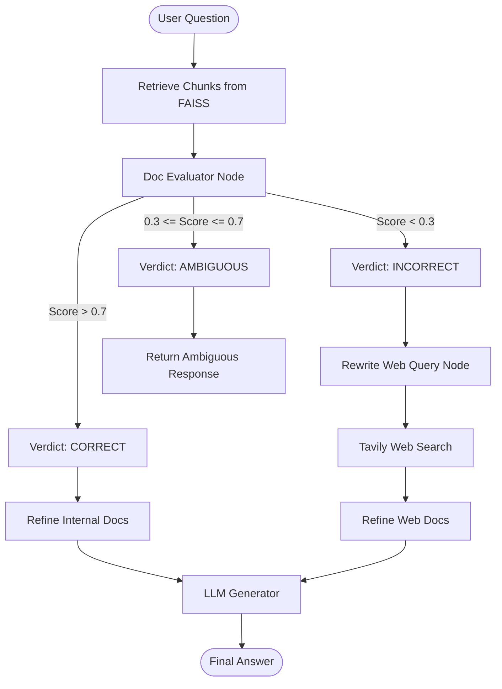

# Corrective Retrieval-Augmented Generation (CRAG)

An advanced implementation of **Corrective Retrieval-Augmented Generation (CRAG)** built with **LangGraph**, **LangChain**, **Mistral AI**, and **Tavily Search**.

This repository demonstrates how to improve RAG system robustness by evaluating retrieved document quality, dynamically refining internal knowledge, rewriting search queries when document retrieval fails, and fetching fallback results from the external web.

---

## 📌 Overview

Standard RAG systems struggle when retriever output is irrelevant, noisy, or insufficient, often causing the LLM to hallucinate or fail. **Corrective RAG (CRAG)** introduces a lightweight **Retrieval Evaluator**, a **Query Rewriter**, and a **Knowledge Refinement** process to ensure high-quality context generation:

1. **Retrieval Evaluation**: Evaluates retrieved document chunks and assigns a confidence score ($0.0 - 1.0$) mapped to three verdicts:
   - `CORRECT`: High relevance ($> 0.7$). Proceeds directly to refine internal documents.
   - `INCORRECT`: Low relevance ($< 0.3$). Triggers query rewriting and external web search via Tavily API.
   - `AMBIGUOUS`: Mixed relevance signals ($0.3 \le \text{score} \le 0.7$). Routes to ambiguity handler.
2. **Query Rewriting (Web Search Preparation)**:
   - When internal retrieval fails (`INCORRECT`), an LLM query rewriter transforms natural language user questions into concise, keyword-optimized search queries ($6 - 14$ words) with explicit time/recency constraints (e.g., adding `(last 30 days)`).
3. **Knowledge Refinement**:
   - **Decomposition**: Splits retrieved documents or web search results into granular sentence strips.
   - **Filtering**: Uses an LLM relevance filter (`KeepOrDrop`) to strip out unhelpful noise.
   - **Recomposition**: Glues the kept relevant sentences into a clean, concise context for final answer synthesis.
4. **Web Search Fallback**: Automatically fetches fresh web search results using the rewritten query when the internal knowledge base fails to provide relevant context.

---

## 🏗️ Architecture & Workflow



---

## 🛠️ Project Structure

```text
corrective-rag/
├── documents/                       # Source PDF documents for FAISS vector store
│   ├── book1.pdf
│   ├── book2.pdf
│   └── book3.pdf
├── retrieval-refinement.ipynb       # Module 1: Sentence-level Knowledge Refinement
├── retrieval-evaluator.ipynb        # Module 2: Retrieval Evaluator & Verdict Routing
├── web_search_refinement.ipynb      # Module 3: Basic Web Search Fallback Pipeline
├── query_rewrite.ipynb              # Module 4: CRAG Pipeline with LLM Query Rewriting
├── .env                             # API Keys (Mistral AI, Tavily, etc.)
└── README.md                        # Project Documentation
```

---

## 🚀 Notebook Breakdown

### 1. `retrieval-refinement.ipynb`
Focuses on sentence-level **Decompose-Filter-Recompose** context refinement:
- Embeds PDF documents with `MistralAIEmbeddings` (`mistral-embed-2312`).
- Decomposes retrieved text chunks into sentence strips.
- Applies a structured output Pydantic filter (`KeepOrDrop`) powered by `ChatMistralAI`.
- Recomposes filtered strips into clean context for answer generation.

### 2. `retrieval-evaluator.ipynb`
Focuses on evaluating document retrieval confidence:
- Evaluates individual document chunks against the user question (`DocEvalScore`).
- Classifies retrieval quality into `CORRECT`, `INCORRECT`, or `AMBIGUOUS`.
- Configures conditional edges in `LangGraph` (`StateGraph`) to route execution.

### 3. `web_search_refinement.ipynb`
Integrates the baseline CRAG state graph:
- Connects document retrieval, evaluation, Tavily web search fallback, refinement, and generation.
- Executes direct web search using raw user questions when internal vector store confidence is low.

### 4. `query_rewrite.ipynb` *(Latest)*
Extends CRAG with an automated **Query Rewriter** node:
- Uses a structured Pydantic model (`WebQuery`) and `ChatMistralAI` to optimize raw user queries into effective web search terms before executing search.
- Handles time-sensitive questions by appending temporal filters (e.g., `last 30 days`).
- Routes `INCORRECT` evaluation verdicts: `eval_each_doc` $\rightarrow$ `rewrite_query` $\rightarrow$ `web_search` $\rightarrow$ `refine` $\rightarrow$ `generate`.

---

## ⚡ Setup & Installation

### Prerequisites
- **Python 3.10+**
- Active API keys for:
  - **Mistral AI** (`MISTRAL_API_KEY`)
  - **Tavily Search** (`TAVILY_API_KEY`)

### Environment Configuration

Create a `.env` file in the `corrective-rag/` root directory:

```bash
MISTRAL_API_KEY=your_mistral_api_key_here
TAVILY_API_KEY=your_tavily_api_key_here
```

### Required Packages

Ensure the following packages are installed in your Python environment:

```bash
pip install langchain langchain-mistralai langchain-community langgraph faiss-cpu pypdf pydantic python-dotenv tavily-python
```

---

## 📖 Key Technologies

| Technology | Role |
| :--- | :--- |
| **LangGraph** | Cyclic state machine graph execution & conditional routing |
| **LangChain** | Document loaders, text splitters, prompt templates, and tool integration |
| **Mistral AI** | Embeddings (`mistral-embed-2312`) & Chat Model (`mistral-small-2603`) |
| **FAISS** | In-memory similarity vector store |
| **Tavily Search** | Real-time web search integration |
| **Query Rewriter** | Structured Pydantic chain optimizing search queries prior to web fallback |

---

## 📜 References

- **Corrective Retrieval-Augmented Generation (CRAG)**: Yan et al., 2024. [arXiv:2401.15884](https://arxiv.org/abs/2401.15884)
