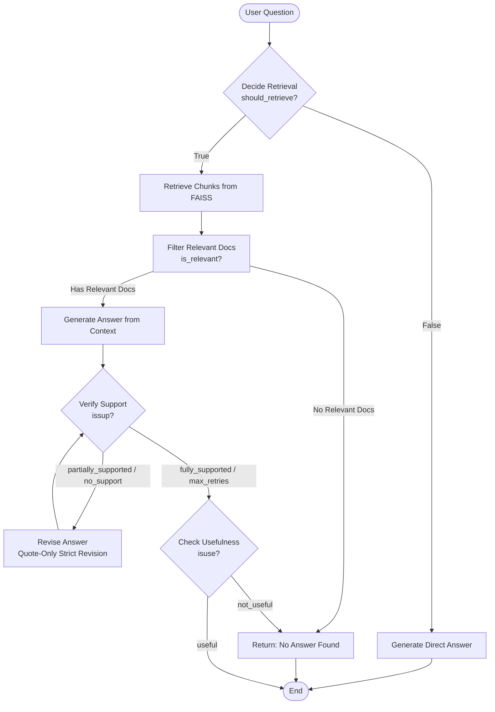

# Self-Reflective Retrieval-Augmented Generation (Self-RAG)

A progressive, step-by-step implementation of **Self-Reflective Retrieval-Augmented Generation (Self-RAG)** built using **LangGraph**, **LangChain**, **Mistral AI / OpenAI**, and **FAISS**.

This repository demonstrates how to build an adaptive RAG system that uses self-reflection tokens to dynamically decide when to retrieve documents, filter irrelevant context, critique answer groundedness, iteratively revise answers, and evaluate answer usefulness.

---

## 📌 Overview

Standard RAG pipelines follow a rigid *Retrieve $\rightarrow$ Generate* path regardless of query complexity or retrieval quality. **Self-RAG** introduces four critique/reflection checkpoints:

1. **`IS_RETRIEVE` (Retrieve Decision)**: Dynamically decides whether a user question requires external knowledge retrieval or can be answered directly using parametric LLM knowledge.
2. **`IS_REL` (Document Relevance)**: Evaluates each retrieved document chunk to filter out unhelpful or off-topic context.
3. **`IS_SUP` (Groundedness / Support Verification)**: Checks if every claim in the generated answer is strictly supported by the context without unsupported abstractions, interpretations, or hallucinations. Includes an iterative quote-only revision loop.
4. **`IS_USE` (Usefulness Evaluation)**: Verifies whether the final answer directly and usefully answers the user's original question.

---

## 🏗️ Architecture & Full Workflow (Step 5)



---

## 🛠️ Project Structure

```text
self-rag/
├── documents/                         # Enterprise PDF Knowledge Base
│   ├── Company_Policies.pdf
│   ├── Company_Profile.pdf
│   └── Product_and_Pricing.pdf
├── self-rag-step1.ipynb               # Step 1: Adaptive Retrieval Decision (IS_RETRIEVE)
├── self-rag-step2.ipynb               # Step 2: Document Relevance Filtering (IS_REL)
├── self-rag-step3.ipynb               # Step 3: Contextual Answer Generation vs. Fallback
├── self-rag-step4.ipynb               # Step 4: Groundedness Verification (IS_SUP) & Revision Loop
├── self-rag-step5.ipynb               # Step 5: Full Self-RAG Pipeline with Usefulness Check (IS_USE)
├── .env                               # Environment Configuration (API Keys)
└── README.md                          # Documentation
```

---

## 🚀 Progressive Notebook Breakdown

### 1. `self-rag-step1.ipynb` — Adaptive Retrieval (`IS_RETRIEVE`)
- Implements a structured output Pydantic model (`RetrieveDecision`).
- Routes general knowledge questions (e.g., *"What is Machine Learning?"*) directly to LLM generation.
- Routes specific factual questions (e.g., *"Who is the CEO of NexaAI?"*) to document retrieval.

### 2. `self-rag-step2.ipynb` — Relevance Filtering (`IS_REL`)
- Adds a document relevance evaluator node (`RelevanceDecision`).
- Filters retrieved FAISS vector chunks at a topic level, discarding irrelevant document snippets before generation.

### 3. `self-rag-step3.ipynb` — Contextual Generation & Fallback
- Introduces `generate_from_context` and `no_relevant_docs` nodes.
- Stuffs filtered relevant documents into a context block.
- Fallbacks gracefully to *"No relevant document found"* if no retrieved chunks pass the relevance filter.

### 4. `self-rag-step4.ipynb` — Groundedness Critique (`IS_SUP`) & Revision Loop
- Introduces an `IsSUPDecision` evaluator node (`fully_supported`, `partially_supported`, `no_support`).
- Flags qualitative interpretations or unmentioned assertions.
- Triggers a strict **Quote-Only Revision Loop** (`revise_answer`) up to 10 retries to enforce groundedness.

### 5. `self-rag-step5.ipynb` — Full Self-RAG Pipeline (`IS_USE`)
- Integrates the final reflection checkpoint: `IsUSEDecision` (`useful` vs. `not_useful`).
- Evaluates if the grounded answer actually answers the user's intent.
- Completes the full Self-RAG state graph.

---

## ⚡ Setup & Installation

### Prerequisites
- **Python 3.10+**
- Active API keys for:
  - **Mistral AI** (`MISTRAL_API_KEY`) or **OpenAI** (`OPENAI_API_KEY`)

### Environment Configuration

Create a `.env` file in the `self-rag/` root directory:

```bash
MISTRAL_API_KEY=your_mistral_api_key_here
OPENAI_API_KEY=your_openai_api_key_here
```

### Required Packages

Install dependencies:

```bash
pip install langchain langchain-mistralai langchain-openai langchain-community langgraph faiss-cpu pypdf pydantic python-dotenv
```

---

## 📖 Key Technologies

| Technology | Role |
| :--- | :--- |
| **LangGraph** | Cyclic state machine graph execution & conditional routing |
| **LangChain** | Document loaders, text splitters, prompt templates, and LLM chains |
| **Mistral AI** | Embeddings (`mistral-embed-2312`) & Chat Models (`mistral-small-2603`) |
| **FAISS** | Similarity vector store for internal document chunks |
| **Pydantic v2** | Structured JSON schema validation for self-reflection decisions |

---

## 📜 References

- **Self-RAG: Learning to Retrieve, Generate, and Critique through Self-Reflection**: Asai et al., 2023. [arXiv:2310.11511](https://arxiv.org/abs/2310.11511)
